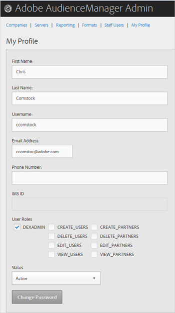
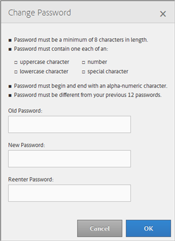

# Min profil {#my-profile}

Redigera informationen om din Audience Manager Admin-verktygsprofil eller ändra ditt lösenord.

<!-- c_my_profile.xml -->

## Redigera profil {#edit-profile}

Visa och redigera din Audience Manager Admin-verktygsprofil, inklusive för- och efternamn, användarnamn, e-postadress, telefonnummer, [!UICONTROL IMS ID]användarroller och status.

<!-- t_edit_profile.xml -->

1. Klicka på **[!UICONTROL My Profile]**.

   

2. Fyll i fälten:
   * **[!UICONTROL First Name]:**(Obligatoriskt) Ange ditt förnamn.
   * **[!UICONTROL Last Name]:**(Obligatoriskt) Ange ditt efternamn.
   * **[!UICONTROL Username]:**(Obligatoriskt) Ange ditt första användarnamn.
   * **[!UICONTROL Email Address]:**(Obligatoriskt) Ange din e-postadress.
   * **[!UICONTROL Phone Number]:**Ange ditt telefonnummer.
   * **[!UICONTROL IMS ID]:**Ange ditt ID för Internet Messaging Service.
   * **[!UICONTROL User Roles]:**Välj önskade användarroller:
      * **[!UICONTROL DEXADMIN]:**Ger administratörsåtkomst för att utföra åtgärder i verktyget Audience Manager Admin. Om du inte markerar det här alternativet kan du välja enskilda roller. Med de här rollerna kan användare utföra uppgifter med hjälp av[!DNL API]anrop, men inte med hjälp av administrationsverktyget.
      * **[!UICONTROL CREATE_USERS]:**Tillåter användare att skapa nya användare med ett[!DNL API]samtal.
      * **[!UICONTROL DELETE_USERS]:**Tillåter användare att ta bort befintliga användare med ett[!DNL API]samtal.
      * **[!UICONTROL EDIT_USERS]:**Tillåter användare att redigera befintliga användare med ett[!DNL API]samtal.
      * **[!UICONTROL VIEW_USERS]:**Låter användare visa andra användare i din Audience Manager-konfiguration med hjälp av ett[!DNL API]samtal.
      * **[!UICONTROL CREATE_PARTNERS]:**Användare kan skapa Audience Manager-partners med hjälp av ett[!DNL API]samtal.
      * **[!UICONTROL DELETE_PARTNERS]:**Användare kan ta bort Audience Manager-partners med hjälp av ett[!DNL API]samtal.
      * **[!UICONTROL EDIT_PARTNERS]:**Användare kan redigera Audience Manager-partners med hjälp av ett[!DNL API]samtal.
      * **[!UICONTROL VIEW_PARNTERS]:**Låter användare visa Audience Manager-partners med hjälp av ett[!DNL API]samtal.
   * **[!UICONTROL Status]:**Välj önskad status:
      * **[!UICONTROL Active]:**Anger att den här användaren är en aktiv Audience Manager-användare.
      * **[!UICONTROL Deactivated]:**Anger att den här användaren är en inaktiverad användare i Audience Management.
      * **[!UICONTROL Expired]:**Anger att den här användarens konto i Audience Manager har gått ut.
      * **[!UICONTROL Locked Out]:**Anger att den här användarens konto i Audience Manager är låst.
3. Klicka på **[!UICONTROL Submit]**.

## Ändra lösenord {#change-password}

Ändra lösenordet för verktyget Audience Manager Admin.

<!-- t_change_password.xml -->

1. Klicka på **[!UICONTROL My Profile]**.
1. Klicka på **[!UICONTROL Change Password]**.

   

   Ditt Audience Manager-lösenord måste vara:

   * Minst åtta tecken långa.
   * innehålla minst en versal,
   * Innehåller minst ett gement tecken.
   * innehålla minst en siffra,
   * Innehåller minst ett specialtecken.
   * Börja och avsluta med ett alfanumeriskt tecken;
   * Börja och avsluta med ett alfanumeriskt tecken.

1. Ange ditt gamla lösenord.
1. Ange ditt nya lösenord och bekräfta sedan det nya lösenordet.
1. Klicka på **[!UICONTROL OK]**.