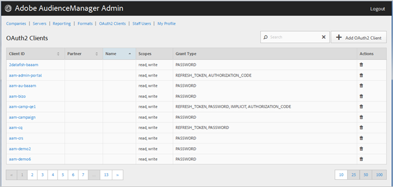

# OAuth2-klienter {#oauth-clients}

Använd [!UICONTROL OAuth2 Clients] sidan för att visa en lista över [!UICONTROL OAuth2] klienter i din [!DNL Audience Manager] konfiguration. Du kan redigera eller ta bort befintliga klienter eller skapa nya klienter, förutsatt att du har tilldelats rätt användarroller.

## Översikt {#overview}

<!-- c_oauth.xml -->

>[!NOTE]
>
>Se till att kunden läser [OAuth2](https://docs.adobe.com/content/help/en/audience-manager/user-guide/api-and-sdk-code/rest-apis/aam-api-getting-started.html#oauth) -dokumentationen i [!DNL Audience Manager User Guide.

[!DNL OAuth2] är en öppen standard för auktorisering som ger skyddad delegerad åtkomst till [!DNL Audience Manager] resurser för en resursägares räkning.

Du kan sortera varje kolumn i stigande eller fallande ordning genom att klicka på den önskade kolumnens rubrik.

Använd [!UICONTROL Search] rutan eller sidnumreringskontrollerna längst ned i listan för att hitta den önskade klienten.

## Skapa eller redigera en OAuth2-klient {#create-edit-client}

<!-- t_create_edit_auth.xml -->

Använd sidan [!UICONTROL OAuth2 Clients] i Audience Manager- [!UICONTROL Admin] verktyget för att skapa en ny [!UICONTROL Oauth2] klient eller för att redigera en befintlig klient.

1. Om du vill skapa en ny [!UICONTROL OAuth2] klient klickar du på **[!UICONTROL OAuth2 Clients]** > **[!UICONTROL Add OAuth2 Client]**. Om du vill redigera en befintlig [!UICONTROL OAuth2] klient klickar du på önskad klient i **[!UICONTROL Client ID]** kolumnen.
1. Ange önskat namn för den här [!UICONTROL OAuth2] klienten. Observera att detta är ett namn som bara gäller för posten.
1. Ange [!UICONTROL OAuth2] klientens e-postadress. Endast en e-postadress får användas.
1. Välj önskad partner i **[!UICONTROL Partner]** listrutan.
1. Ange önskat ID i **[!UICONTROL Client ID]** rutan. Detta är det värde som används när [!DNL API] begäranden skickas. Prefixet fylls i automatiskt när du börjar skriva efter att du har valt ett [!UICONTROL Partner] från listrutan i föregående steg. Rätt format är &lt; *`partner subdomain`*> - &lt; *`Audience Manager username`*>.
1. Markera eller avmarkera **[!UICONTROL Restrict to Partner Users]** kryssrutan efter behov. Om den här kryssrutan är markerad måste användaren vara en [!DNL Audience Manager] användare som anges för den valda partnern. Vi rekommenderar att du väljer det här alternativet.
1. Markera eller avmarkera kryssrutorna i **[!UICONTROL Scope]** avsnittet **[!UICONTROL Read]** och **[!UICONTROL Write]** kryssrutorna.
1. I **[!UICONTROL Grant Type]** området väljer du metod för auktorisering. Vi rekommenderar att du använder standardinställningarna för [!UICONTROL Password] och [!UICONTROL Refresh-token] alternativen.

   * **[!UICONTROL Implicit]**: Om du väljer det här alternativet aktiveras [!UICONTROL Redirect URI] rutan. Användaren får en token för automatisk åtkomst efter att ha autentiserats och skickas omedelbart till omdirigeringen [!DNL URI].
   * **[!UICONTROL Authorization Code]**: Om du väljer det här alternativet aktiveras [!UICONTROL Redirect URI] rutan. Användaren returneras till klienten efter att ha autentiserats och skickas sedan till omdirigeringen [!DNL URI].
   * **[!UICONTROL Password]**: Användaren autentiseras med ett användarangivet lösenord i stället för ett automatiskt valideringsförsök via en auktoriseringsserver.
   * **[!UICONTROL Refresh_token]**: Används för att uppdatera en åtkomsttoken som har upphört att gälla under en längre tidsperiod.

1. Ange önskat värde i **[!UICONTROL Redirect URI]** rutan [!DNL URI]. Det här alternativet är bara aktiverat om du väljer typerna **[!UICONTROL Implicit]** och **[!UICONTROL Authorization_code]** typen av bidrag. I **[!UICONTROL Redirect URI]** rutan kan du ange ett kommaavgränsat värde med godtagbara [!DNL URI] värden. Detta är den användare som klienten omdirigeras till efter att ha godkänt klienten för [!DNL URI] [!DNL API] åtkomst.
1. Ange önskad förfallotid (i sekunder) för åtkomst och uppdatering av utgångsdatum för token.

   * **[!UICONTROL Access Token Expiration Time]**: Antalet sekunder som en åtkomsttoken är giltig efter att den har utfärdats. Kan vara null för att använda plattformens standardinställning (12 timmar). Även kan vara -1 för att ange att åtkomsttoken inte upphör att gälla.
   * **[!UICONTROL Refresh Token Expiration Time]**: Antalet sekunder som en uppdateringstoken är giltig efter att den har utfärdats. Kan vara null för att använda plattformens standardinställning (30 dagar).

1. Klicka på **[!UICONTROL Save]**.

Om du vill ta bort en [!UICONTROL OAuth2] klient klickar du på **[!UICONTROL OAuth2 Clients]** och sedan  i **[!UICONTROL Actions]** kolumnen för den önskade klienten.

>[!MORELIKETHIS]
>
>* [Krav och rekommendationer för API](../admin-oauth2/aam-admin-api-requirements.md)

