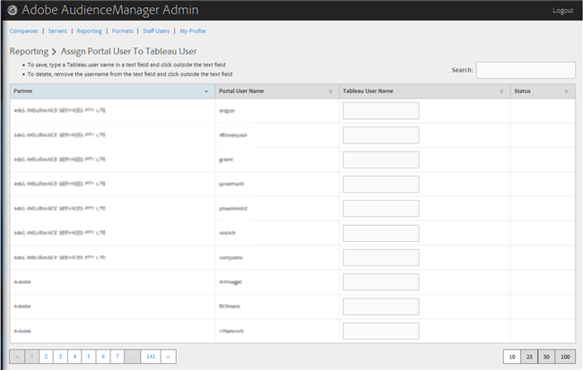

# Assign a Portal User to a Tableau User {#assign-a-portal-user-to-tableau-user}

<!-- t_tabeau.xml -->

Använd [!UICONTROL Reporting] sidan för att göra en portalanvändare till en [!DNL Tableau] användare. Detta gör att användare kan visa [!DNL Tableau] rapporter i Audience Manager.

1. Klicka på **[!UICONTROL Reporting]** > **[!UICONTROL Assign Portal User to Tableau User]**.

   

1. Om du vill tilldela en användare skriver du ett [!DNL Tableau] användarnamn i textfältet på partnerraden och klickar sedan utanför textfältet.

Om du vill ta bort en användartilldelning tar du bort användarnamnet från textfältet på partnerraden och klickar utanför textfältet.
