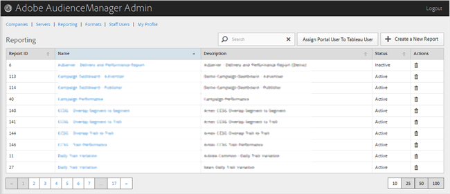

# Rapporter {#reporting}

Hantera Audience Manager-rapporter genom att skapa nya rapporter eller genom att redigera eller ta bort befintliga rapporter. Du kan också tilldela en portalanvändare som [!DNL Tableau] användare.

<!-- c_reporting.xml -->

Du kan sortera varje kolumn i stigande eller fallande ordning genom att klicka på den önskade kolumnens rubrik.

Använd [!UICONTROL Search] rutan eller sidnumreringskontrollerna längst ned i listan för att hitta önskad rapport.
