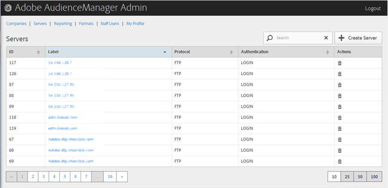

# Ta bort en server {#delete-a-server}

Använd [!UICONTROL Servers] sidan i Audience Manager Admin för att ta bort en befintlig server.

<!-- t_delete_server.xml -->

>[!NOTE]
>
>Du måste ha rollen för [!UICONTROL DEXADMIN] att kunna ta bort befintliga servrar.

1. Om du vill ta bort en befintlig server klickar du på **[!UICONTROL Servers]**.

   

1. Klicka  i **[!UICONTROL Actions]** kolumnen på den önskade servern.
1. Klicka **[!UICONTROL OK]** för att bekräfta borttagningen.
