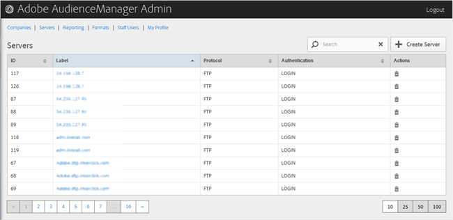

# Översikt över servrar {#servers-overview}

Använd [!UICONTROL Servers] sidan för att visa en lista över servrar i din Audience Manager-konfiguration. Du kan redigera eller ta bort befintliga servrar eller skapa nya servrar, förutsatt att du har tilldelats rätt användarroller.

<!-- c_servers.xml -->

Du kan sortera varje kolumn i stigande eller fallande ordning genom att klicka på den önskade kolumnens rubrik. Använd [!UICONTROL Search] rutan eller sidnumreringskontrollerna längst ned i listan för att hitta önskad server.