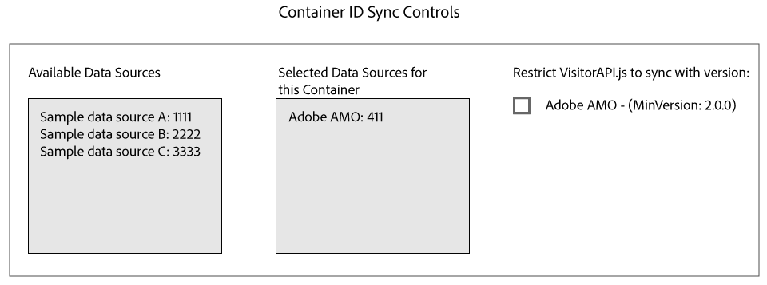

# ID-synkronisering med Media Optimizer {#id-syncing-with-media-optimizer}

Som standard synkroniserar alla företag data med [!DNL Adobe Media Optimizer] ([!DNL AMO]). I [!UICONTROL Admin UI]behållaren har varje företag en datakälla som hanterar den här processen. Datakällan är [!UICONTROL Adobe AMO] ([!UICONTROL ID] 411). Klicka på en behållarrad (under [!UICONTROL Containers] fliken) för ett valt företag för att inaktivera den här standardsynkroniseringen eller för att lägga till och ta bort andra datakällor i [!DNL AMO] synkroniseringsprocessen.

## Synkroniseringsstatus för ID {#id-sync-status}

I följande tabell beskrivs synkroniseringsstatusen för en datakälla.

| Status | Beskrivning |
|------ | -------- |
| Av | Ta bort alla datakällor från [!UICONTROL Selected Data Sources] den här behållaren för att inaktivera ID-synkronisering med [!DNL AMO] |
| På (oavsett ID-tjänstversion) | En datakälla synkroniseras med [!DNL AMO] oavsett ID-tjänstversion när: <ul><li>Datakällan visas i [!UICONTROL Selected Data Sources] listan.</li><li>Kryssrutan [!DNL AMO] är inte ** markerad.</li></ul> |
| På (oavsett ID-tjänstversion) | En datakälla synkroniseras med ID-tjänstversion 2.0 (eller senare) när: [!DNL AMO] <ul><li>Datakällan visas i [!UICONTROL Selected Data Sources] listan.</li><li>Kryssrutan [!DNL AMO] är ** markerad.</li></ul> |

>[!MORELIKETHIS]
>
>* [Hantera behållare](../companies/admin-manage-containers.md#task_61DB5CEECC5049DD8D059C642AC3F967)

