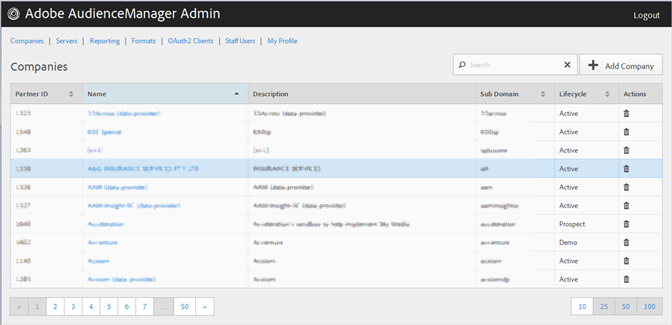

# Företag {#companies}

Använd [!UICONTROL Companies] sidan för att visa en lista över företag i din Audience Manager-konfiguration. Du kan redigera eller ta bort befintliga företag eller skapa nya företag, förutsatt att du har tilldelats rätt användarroller.

Du kan sortera varje kolumn i stigande eller fallande ordning genom att klicka på den önskade kolumnens rubrik.

Använd [!UICONTROL Search] rutan eller sidnumreringskontrollerna längst ned i listan för att hitta önskat företag.
