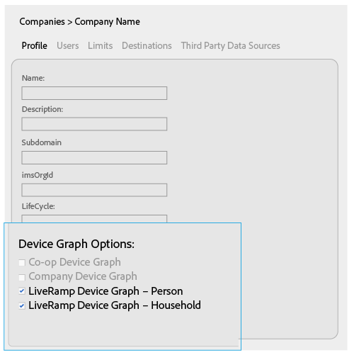
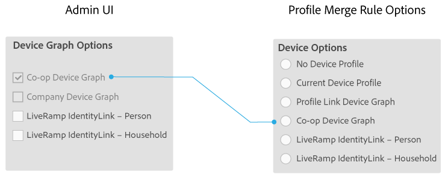
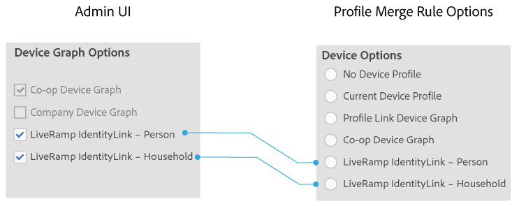

# Alternativ för enhetsdiagram för företag {#device-graph-options-for-companies}

De [!UICONTROL Device Graph Options] är tillgängliga för företag som deltar i [!DNL Adobe Experience Cloud Device Co-op]. Om en kund också har ett avtalsförhållande med en tredjepartsleverantör av enhetsdiagram som är integrerad med Audience Manager, visas alternativ för det enhetsdiagrammet i det här avsnittet. Dessa alternativ finns i [!UICONTROL Companies] > företagsnamn > [!UICONTROL Profile] > [!UICONTROL Device Graph Options].

I den här illustrationen används generiska namn för alternativ för enhetsdiagram från tredje part. I produktionen kommer dessa namn från enhetens diagramleverantör och kan variera från vad som visas här. Alternativen är till exempel [!DNL LiveRamp] vanligtvis (men inte alltid):

* Börja med &quot;[!DNL LiveRamp]&quot;
* Innehåller ett mellannamn som varierar
* Sluta med &quot;[!UICONTROL - Household]&quot; eller &quot;[!UICONTROL -Person]&quot;

## Alternativ för enhetsdiagram definierade {#device-graph-options-defined}

Alternativen för enhetsdiagram som du väljer här visar eller döljer de [!UICONTROL Device Options] alternativ som är tillgängliga för en [!DNL Audience Manager] kund när de skapar en [!UICONTROL Profile Merge Rule].

### Co-op Device Graph {#co-op-graph}

Kunder som deltar i [Adobe Experience Cloud Device Co-op](https://marketing.adobe.com/resources/help/en_US/mcdc/) använder dessa alternativ för att skapa en [!UICONTROL Profile Merge Rule] med [deterministiska och sannolika data](https://marketing.adobe.com/resources/help/en_US/mcdc/mcdc-links.html). Alternativet [!DNL Corporate Provisioning Team] aktiveras och inaktiveras via ett back-end- [!DNL API] anrop. Du kan inte markera eller rensa de här rutorna i [!DNL Admin UI]. Alternativen **[!UICONTROL Co-op Device Graph]** och **[!UICONTROL Company Device Graph]** utesluter varandra. Kunder kan be oss att aktivera den ena eller den andra, men inte båda. När du markerar det här alternativet visas **[!UICONTROL Co-op Device Graph]** kontrollen i [!UICONTROL Device Options] inställningarna för ett [!UICONTROL Profile Merge Rule].

### Företagsenhetsdiagram {#company-graph}

Det här alternativet är till för [!DNL Analytics] kunder som använder [!UICONTROL People] måtten i sin [!DNL Analytics] rapportserie. Alternativet [!DNL Corporate Provisioning Team] aktiveras och inaktiveras via ett back-end- [!DNL API] anrop. Du kan inte markera eller rensa de här rutorna i [!DNL Admin UI]. Alternativen **[!UICONTROL Company Device Graph]** och **[!UICONTROL Co-op Device Graph]** utesluter varandra. Kunder kan be oss att aktivera den ena eller den andra, men inte båda. Vid markering:

* Enhetsdiagrammet använder deterministiska data som tillhör det företag du konfigurerar (inga sannolikhetsdata).
* [!DNL Audience Manager] skapar automatiskt ett [!UICONTROL Data Source] namn som kallas `*`partnernamn`*-Company Device Graph-Person`. På [!UICONTROL Data Source] informationssidan kan [!DNL Audience Manager] kunder ändra partnernamn, beskrivning och tillämpa [dataexportkontroller](https://marketing.adobe.com/resources/help/en_US/aam/c_dec.html) på den här datakällan.
* [!DNL Audience Manager] kunderna *inte* ser någon ny inställning i [!UICONTROL Device Options] avsnittet för en [!UICONTROL Profile Merge Rule].

### LiveRamp Device Graph (Person eller Household) {#liveramp-device-graph}

De här kryssrutorna aktiveras i [!DNL Admin UI] när en partner skapar en [!UICONTROL Data Source] och väljer **[!UICONTROL Use as an Authenticated Profile]** och/eller **[!UICONTROL Use as a Device Graph]**. Namnen på de här inställningarna bestäms av tredjepartsleverantören av enhetsdiagram (t.ex. [!DNL LiveRamp], [!DNL TapAd]osv.). När det här alternativet är markerat kommer det företag du konfigurerar att använda data från dessa enhetsdiagram.

>[!MORELIKETHIS]
>
>* [Alternativ för profilkopplingsregel definierade](https://marketing.adobe.com/resources/help/en_US/aam/merge-rule-definitions.html)
>* [Inställningar för datakälla och menyalternativ](https://marketing.adobe.com/resources/help/en_US/aam/datasource-settings-definitions.html)

