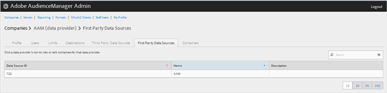
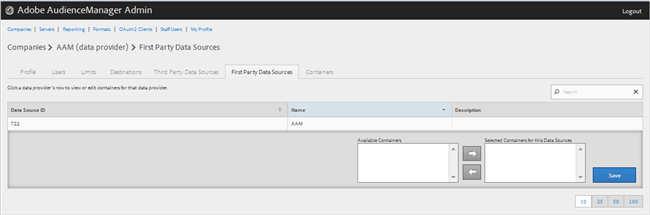

# Hantera förstaparts dataleverantörer {#manage-first-party-data-providers}

Visa eller redigera behållare och mappningar för förstahandsleverantörer.

<!-- t_first_party_providers.xml -->

1. Klicka **[!UICONTROL Companies]** letar du upp och klickar på önskat företag för att visa [!UICONTROL Profile] sida. Använd [!UICONTROL Search] eller sidnumreringskontrollerna längst ned i listan för att hitta det önskade företaget. Du kan sortera varje kolumn i stigande eller fallande ordning genom att klicka på den önskade kolumnens rubrik.

1. Klicka på **[!UICONTROL First Party Data Providers]** -fliken.

   

1. Klicka på en dataleverantörs rad för att visa eller redigera behållare och mappningar för den dataleverantören.

   

1. Flytta behållare från **[!UICONTROL Available Containers]** och **[!UICONTROL Selected Containers for This Data Provider]** genom att markera önskade behållare och sedan klicka på höger- eller vänsterpilarna efter behov.
1. Klicka **[!UICONTROL Save]** om du har gjort ändringar.
