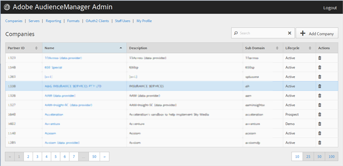

# Skapa en företagsprofil {#create-a-company-profile}

Använd [!UICONTROL Companies] i Audience Manager Admin-verktyget för att skapa ett nytt företag.

<!-- t_create_company.xml -->

>[!NOTE]
>
>Du måste ha **[!UICONTROL DEXADMIN]** roll för att skapa nya företag.

1. Klicka på **[!UICONTROL Companies]** > **[!UICONTROL Add Company]**.
1. Fyll i fälten:

   * **[!UICONTROL Name]**: (Obligatoriskt) Ange företagets namn.
   * **[!UICONTROL Description]**: (Obligatoriskt) Ange beskrivande information om företaget, till exempel bransch eller dess fullständiga namn.
   * **[!UICONTROL Subdomain]**: (Obligatoriskt) Ange företagets underdomän. Den text du anger är den som visas som underdomän till händelseanropet. Det här kan inte ändras. Det måste vara en sträng med [!DNL URL]-giltiga tecken.

      Om ditt företag till exempel har fått ett namn [!DNL AcmeCorp]blir underdomänen [!DNL acmecorp].

      Audience Manager använder underdomänen för [!UICONTROL Data Collection Server] (DCS). I föregående exempel, om ditt företag är fullt [!DNL URL] in [!UICONTROL DCS] skulle vara [!DNL acmecorp.demdex.net].

   * **[!UICONTROL Lifecyle]**: Ange önskat stadium för företaget:
      * **[!UICONTROL Active]**: Ange att företaget ska vara en aktiv Audience Manager-klient. An [!UICONTROL Active] konto innebär en betalande kund, inte bara för konsulttjänster, utan för SKU:n Audience Manager.
      * **[!UICONTROL Demo]**: Ange att företaget endast är för demoändamål. Rapporteringsdata förfalskas automatiskt.
      * **[!UICONTROL Prospect]**: Ange att företaget är en potentiell Audience Manager-klient, till exempel ett företag som får ett gratisprogram [!DNL POC] eller en kontoinställning för en försäljningsdemo.
      * **[!UICONTROL Test]**: Ange att företaget endast ska användas för intern testning.
   * **[!UICONTROL Account Types]**: Ange den fullständiga uppsättningen kontotyper för det här företaget. Ingen kontotyp utesluter varandra med andra typer.
      * **[!UICONTROL Full AAM]**: Ange att företaget ska ha ett fullständigt Adobe Audience Manager-konto och att användarna ska ha inloggningsåtkomst.
      * **[!UICONTROL MMP]**: Ange att företaget har aktiverats för att använda [!UICONTROL Master Marketing Profile] ([!UICONTROL MMP]). The [!UICONTROL MMP] gör det möjligt att dela målgrupper över hela Experience Cloud med [!UICONTROL Experience Cloud ID] ([!DNL MCID]) som tilldelas alla besökare och sedan används av Audience Manager. Om du väljer den här kontotypen [!UICONTROL Experience Cloud ID Service] markeras också automatiskt.

         Mer information finns i [Experience Cloud målgrupper](https://experienceleague.adobe.com/docs/core-services/interface/services/audiences/audience-library.html?lang=en).
   * **[!UICONTROL Data Source]**: Ange att företaget är en tredjeparts dataleverantör inom Audience Manager.
   * **[!UICONTROL Targeting Partner]**: Ange att företaget fungerar som en målinriktningsplattform för Audience Manager-kunder.
   * **[!UICONTROL Visitor ID Service]**: Ange att företaget har aktiverats för att använda [!UICONTROL Experience Cloud Visitor ID Service].

      The [!UICONTROL Experience Cloud Visitor ID Service] tillhandahåller ett universellt besökar-ID för olika Experience Cloud-lösningar. Mer information finns i [Användarhandbok för tjänsten Experience Cloud Visitor ID](https://experienceleague.adobe.com/docs/id-service/using/intro/overview.html?lang=en).

   * **[!UICONTROL Agency]**: Ange att företaget ska ha en [!UICONTROL Agency] konto.

1. Klicka på **[!UICONTROL Create]**. Fortsätt med instruktionerna i [Redigera en företagsprofil](../companies/admin-manage-company-profiles.md#edit-company-profile).

   

## Redigera en företagsprofil {#edit-company-profile}

Redigera ett företags profil, inklusive namn, beskrivning, underdomän, livscykel med mera.

<!-- t_edit_company_profile.xml -->

1. Klicka **[!UICONTROL Companies]** letar du upp och klickar på önskat företag för att visa [!UICONTROL Profile] sida.

   Använd [!UICONTROL Search] eller sidnumreringskontrollerna längst ned i listan för att hitta det önskade företaget. Du kan sortera varje kolumn i stigande eller fallande ordning genom att klicka på den önskade kolumnens rubrik.

   

1. Redigera fälten efter behov:

   * **[!UICONTROL Name]**: Redigera företagets namn. Detta är ett obligatoriskt fält.
   * **[!UICONTROL Description]**: Redigera företagsbeskrivningen. Detta är ett obligatoriskt fält.
   * **[!UICONTROL Subdomain]**: (Obligatoriskt) Ange företagets underdomän. Den text du anger är den som visas som underdomän till händelseanropet. Det här kan inte ändras. Det måste vara en sträng med [!DNL URL]-giltiga tecken.

      Om ditt företag till exempel har fått ett namn [!DNL AcmeCorp]blir underdomänen [!DNL acmecorp].

      Audience Manager använder underdomänen för [!UICONTROL Data Collection Server] (DCS). I föregående exempel, om ditt företag är fullt [!DNL URL] in [!UICONTROL DCS] skulle vara [!DNL acmecorp.demdex.net].

   * **[!UICONTROL imsOrgld]**: ([!UICONTROL Identity Management System Organization ID]) Med detta ID kan du ansluta ditt företag till Adobe Experience Cloud.
   * **[!UICONTROL Lifecyle]**: Ange önskat stadium för företaget:
      * **[!UICONTROL Active]**: Ange att företaget ska vara en aktiv Audience Manager-klient. Ett aktivt konto innebär en betalande kund, inte bara för konsulttjänster, utan för SKU:n i Audience Manager.
      * **[!UICONTROL Demo]**: Ange att företaget endast är för demoändamål. Rapporteringsdata förfalskas automatiskt.
      * **[!UICONTROL Prospect]**: Ange att företaget är en potentiell Audience Manager-klient, till exempel ett företag som får ett gratisprogram [!DNL POC] eller en kontoinställning för en försäljningsdemo.
      * **[!UICONTROL Test]**: Ange att företaget endast ska användas för intern testning.
   * **[!UICONTROL Account Types]**: Ange den fullständiga uppsättningen kontotyper för det här företaget. Ingen kontotyp utesluter varandra med andra typer.
      * **[!UICONTROL Full AAM]**: Ange att företaget ska ha ett fullständigt Adobe Audience Manager-konto och att användarna ska ha inloggningsåtkomst.
      * **[!UICONTROL MMP]**: Ange att företaget har aktiverats för att använda den Överordnad marknadsföringsprofilen ([!UICONTROL MMP]).

         Om du väljer den här kontotypen **[!UICONTROL Visitor ID Service]** markeras också automatiskt.
Mer information finns i [Experience Cloud målgrupper](https://experienceleague.adobe.com/docs/core-services/interface/services/audiences/audience-library.html?lang=en).
   * **[!UICONTROL Data Source]**: Ange att företaget är en tredjeparts dataleverantör inom Audience Manager.
   * **[!UICONTROL Targeting Partner]**: Ange att företaget fungerar som en målinriktningsplattform för Audience Manager-kunder.
   * **[!UICONTROL Visitor ID Service]**: Ange att företaget har aktiverats för att använda tjänsten Experience Cloud Visitor ID.

      Experience Cloud Visitor ID-tjänsten tillhandahåller ett universellt besökar-ID för olika Experience Cloud-lösningar. Mer information finns i [Användarhandbok för tjänsten Experience Cloud ID](https://experienceleague.adobe.com/docs/id-service/using/home.html?lang=en).

   * **[!UICONTROL Agency]**: Ange att företaget ska ha ett byråns konto.
   * **[!UICONTROL Features]**: Välj önskade alternativ:
      * **[!UICONTROL Password Expiration]**: Anger att alla användarlösenord inom det här företaget upphör att gälla efter 90 dagar för att öka säkerheten i Audience Manager.
      * **[!UICONTROL Reporting]**: Aktiverar Audience Manager-rapportering för det här företaget.
      * **[!UICONTROL Role Based Access Controls]**: Aktivera rollbaserade åtkomstkontroller för det här företaget. Med rollbaserade åtkomstkontroller kan du skapa användargrupper med olika åtkomstbehörigheter. Enskilda användare i dessa grupper kan sedan bara få åtkomst till vissa funktioner i Audience Manager.

1. Klicka på **[!UICONTROL Submit Updates]**.

## Ta bort en företagsprofil {#delete-company-profile}

Använd [!UICONTROL Companies] sida i Audience Manager [!UICONTROL Admin] för att ta bort ett befintligt företag.

<!-- t_delete_company.xml -->

>[!NOTE]
>
>Du måste ha [!UICONTROL DEXADMIN] roll för att ta bort befintliga företag.

1. Om du vill ta bort ett befintligt företag klickar du på **[!UICONTROL Companies]**.

   

1. Klicka   i **[!UICONTROL Actions]** -kolumn för det önskade företaget.
1. Klicka **[!UICONTROL OK]** för att bekräfta borttagningen.
