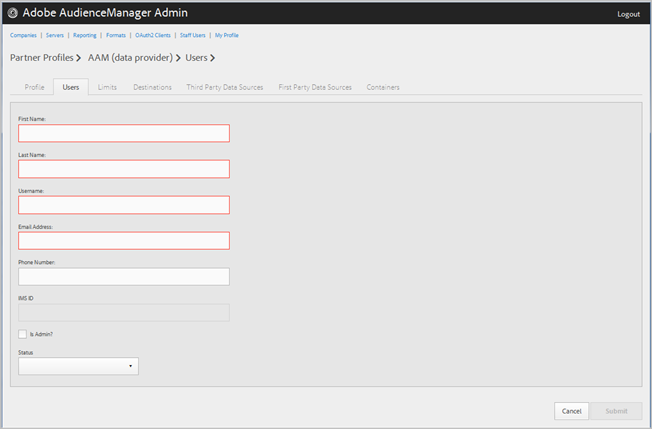

# Hantera företagsanvändare {#manage-company-users}

Skapa nya Audience Manager-användare eller redigera och ta bort befintliga användare.

<!-- t_manage_company_users.xml -->

1. Klicka **[!UICONTROL Companies]** letar du upp och klickar på önskat företag för att visa [!UICONTROL Profile] sida.

   Använd [!UICONTROL Search] eller sidnumreringskontrollerna längst ned i listan för att hitta det önskade företaget. Du kan sortera varje kolumn i stigande eller fallande ordning genom att klicka på den önskade kolumnens rubrik.
1. Klicka på **[!UICONTROL Users]** -fliken.
1. Om du vill skapa en ny användare klickar du på **[!UICONTROL Create a New User]**. Om du vill redigera en befintlig användare letar du upp och klickar på önskad användare på **[!UICONTROL Username]** kolumn.

   

1. Fyll i fälten:

   * **[!UICONTROL First Name]**: (Obligatoriskt) Ange användarens förnamn.
   * **[!UICONTROL Last Name]**: (Obligatoriskt) Ange användarens efternamn.
   * **[!UICONTROL Username]**: (Obligatoriskt) Ange användarens Audience Manager-användarnamn. Användarnamn måste vara unika.
   * **[!UICONTROL Email Address]**: (Obligatoriskt) Ange användarens e-postadress.
   * **[!UICONTROL Phone Number]**: Ange användarens telefonnummer.
   * **[!UICONTROL IMS ID]**: Användarens [!UICONTROL Identity Management System ID]. Med detta ID kan användaren länka till Adobe-lösningar till Adobe Experience Cloud.
   * **[!UICONTROL Is Admin]**: Gör den här användaren till en Audience Manager-administrativ användare. En administratör har alla användarroller i Audience Manager för den här partnern.
   * **[!UICONTROL Status]**: När du skapar en ny användare visas det här fältet inledningsvis som **[!UICONTROL Pending]** tills användaren loggar in och återställer det tillfälliga lösenordet. Om du redigerar en befintlig användare kan du välja mellan följande statusvärden:
      * **[!UICONTROL Active]**: Anger att den här användaren är en aktiv Audience Manager-användare.
      * **[!UICONTROL Deactivated]**: Anger att den här användaren är en inaktiverad Audience Manager-användare.
      * **[!UICONTROL Expired]**: Anger att den här användaren är en användare som har gått ut.
      * **[!UICONTROL Locked Out]**: Anger att användaren är en låst användare.

1. Klicka på **[!UICONTROL Submit]**.

## Ta bort en användare {#delete-user}

Så här tar du bort en användare:

1. Klicka **[!UICONTROL Companies]**, letar upp och klickar på önskat företag och klickar sedan på **[!UICONTROL Users]** -fliken.
1. Klicka   i **[!UICONTROL Actions]** -kolumnen för den önskade användaren.
1. Klicka **[!UICONTROL OK]** för att bekräfta borttagningen.
