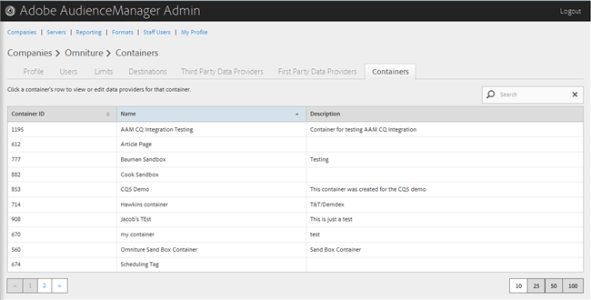
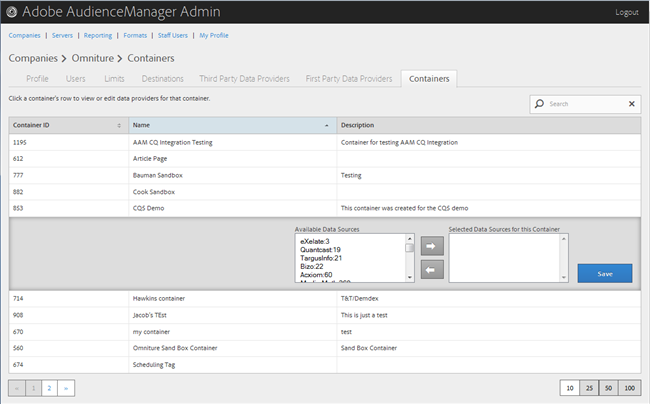

# Hantera behållare {#manage-containers}

Visa eller redigera dataleverantörer för behållare.

<!-- t_containers.xml -->

>[!NOTE]
>
>Som standard skapas företag med en behållare. Du kan skapa ytterligare behållare för ett företag i användargränssnittet i **[!UICONTROL Tools > Tags]**.

1. Klicka **[!UICONTROL Companies]** och sedan på önskat företag för att visa dess [!UICONTROL Profile] sida.

   Använd [!UICONTROL Search] rutan eller sidnumreringskontrollerna längst ned i listan för att hitta önskat företag. Du kan sortera varje kolumn i stigande eller fallande ordning genom att klicka på den önskade kolumnens rubrik.

1. Klicka på **[!UICONTROL Containers]** fliken.

   

1. Klicka på en behållares rad för att visa eller redigera dataleverantörer för den behållaren.

   

1. Flytta datakällor från **[!UICONTROL Available Data Sources]** och **[!UICONTROL Selected Data Sources for This Container]** listor genom att markera önskade datakällor och sedan klicka på höger- eller vänsterpilarna efter behov.

   Du kan även utföra den här uppgiften från [tredjeparts](../companies/admin-third-party-providers.md#task_E942DD674D794BA6B8EFD52FD866E689)dataleverantörssida.

1. Klicka **[!UICONTROL Save]** om du har gjort ändringar.

>[!MORELIKETHIS]
>
>* [ID-synkronisering med Media Optimizer](../companies/admin-amo-sync.md#concept_2B5537233DAA4860B3503B344F937D83)

