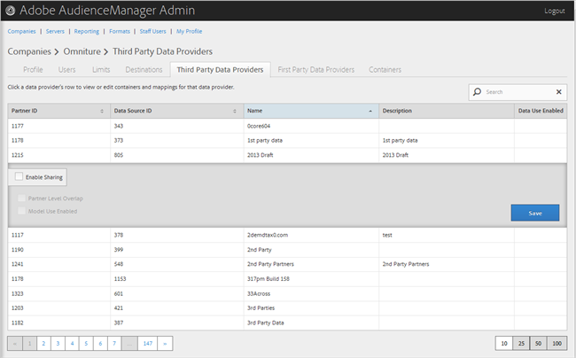

# Hantera tredjeparts dataleverantörer {#manage-third-party-data-providers}

Visa eller redigera behållare och mappningar för tredjeparts dataleverantörer. Du kan också aktivera delning med olika dataleverantörer.

1. Klicka **[!UICONTROL Companies]** letar du upp och klickar på önskat företag för att visa [!UICONTROL Profile] sida.

   Använd [!UICONTROL Search] eller sidnumreringskontrollerna längst ned i listan för att hitta det önskade företaget. Du kan sortera varje kolumn i stigande eller fallande ordning genom att klicka på den önskade kolumnens rubrik.
1. Klicka på **[!UICONTROL Third Party Data Providers]** -fliken.

   

1. Klicka på en dataleverantörs rad för att visa eller redigera behållare och mappningar för den dataleverantören.

   

1. Välj **[!UICONTROL Enable Sharing]** om du vill aktivera följande alternativ:

   * **Överlappning på partnernivå:**
   * **Modellanvändning aktiverad:** Tillåter det här företaget att använda den här DataProvider när algoritmiska modeller skapas.

   När du aktiverar delning får du åtkomst till egenskaper från den här DataProvider.

1. (Villkorligt) Om behållaren är aktiverad för den här providern kan du välja behållare för den här DataProvider genom att flytta de önskade behållarna från den tillgängliga listan till den valda listan.

   Du kan även utföra den här uppgiften från [Behållare](../companies/admin-manage-containers.md#task_61DB5CEECC5049DD8D059C642AC3F967) sida.
1. Klicka **[!UICONTROL Save]** om du har gjort ändringar.
