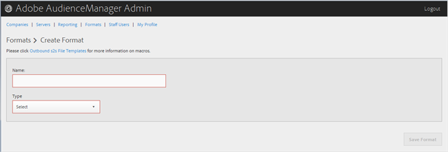

# Skapa eller redigera ett format {#create-or-edit-a-format}

Använd [!UICONTROL Formats] sidan i administrationsverktyget för Audience Manager för att skapa ett nytt format eller för att redigera ett befintligt format.

<!-- t_create_format.xml -->

>[!TIP]
>
>När du väljer ett format för dina utgående data är det bäst att återanvända ett befintligt format om det är möjligt. Om du använder ett redan beprövat format kan du vara säker på att dina utgående data genereras korrekt. Om du vill se exakt hur ett befintligt format är formaterat klickar du på [!UICONTROL Formats] alternativet på menyraden och söker efter formatet antingen efter namn eller efter ID-nummer. Felformaterade format eller makron som används i format ger felaktigt formaterade utdata eller förhindrar att informationen skrivs ut helt.

1. Om du vill skapa ett nytt format klickar du på **[!UICONTROL Formats]** > **[!UICONTROL Add Format]**. Om du vill redigera ett format klickar du på det i **[!UICONTROL Name]** kolumnen önskade formatet.

   

1. Fyll i fälten:
   * **Namn:** (Obligatoriskt) Ange ett beskrivande namn för formatet.
   * **Typ:** (Obligatoriskt) Välj önskat format:
      * **[!UICONTROL File]**: Skickar data via [!DNL FTP] filer.
      * **[!UICONTROL HTTP]**: Omsluter data i en [!DNL JSON] wrapper.

1. (Villkorligt) Om du väljer **[!UICONTROL File]**, fyll i fälten:

   >[!NOTE]
   >
   >En lista över tillgängliga makron finns i [Filformatmakron](../formats/file-formats.md#concept_A867101505074418A58DE325949E5089) och [HTTP-formatmakron](../formats/web-formats.md#reference_C392124A5F3F42E49F8AADDBA601ADFE).

   * **[!UICONTROL File Name]:**Ange filnamnet för dataöverföringsfilen.
   * **Sidhuvud:** Ange texten som visas på den första raden i dataöverföringsfilen.
   * **[!UICONTROL Data Row]:**Ange den text som visas i varje avgränsad rad i filen.
   * **[!UICONTROL Maximum File Size (In MB)]:**Ange den maximala filstorleken för dataöverföringsfiler. Komprimerade filer måste vara mindre än 100 MB. Det finns ingen gräns för okomprimerad filstorlek.
   * **[!UICONTROL Compression]:**Välj önskad komprimeringstyp: gz eller zip för datafilerna. För leverans till[!UICONTROL AWS S3]måste du använda .gz eller okomprimerade filer.
   * **[!UICONTROL .info Receipt]:**Anger att en fil för överföringskontroll ([!DNL .info]) genereras. Filen innehåller metadatainformation om filöverföringar så att partners kan verifiera att filöverföringar hanteras korrekt av Audience Manager.[!DNL .info]Mer information finns i[Överföringskontrollfiler för loggfilsöverföringar](https://marketing.adobe.com/resources/help/en_US/aam/c_s2s_add_transfer_control_files.html).
   * **[!UICONTROL MD5 Checksum Receipt]:**Anger att en inleverans av en[!DNL MD5]kontrollsumma genereras. Kvittot för kontrollsumman så att partners kan verifiera att Audience Manager har hanterat den fullständiga överföringen korrekt.[!DNL MD5]

1. (Villkorligt) Om du väljer **[!UICONTROL HTTP]**, fyll i fälten:

   * **[!UICONTROL Method]:**Välj den[!DNL API]metod du vill använda för överföringsprocessen:
      * **[!UICONTROL POST]:**Om du väljer[!DNL POST]markerar du innehållstypen ([!DNL XML]eller[!DNL JSON]) och anger sedan begärandetexten.
      * **[!UICONTROL GET]:**Om du väljer[!DNL GET]anger du frågeparametrarna.

1. Klicka **[!UICONTROL Create]** om du skapar ett nytt format eller klicka **[!UICONTROL Save Updates]** om du redigerar ett befintligt format.

## Ta bort ett format {#delete-format}

1. Klicka på **[!UICONTROL Formats]**.
2. Klicka  i **[!UICONTROL Actions]** kolumnen med önskat format.
3. Klicka **[!UICONTROL OK]** för att bekräfta borttagningen.
