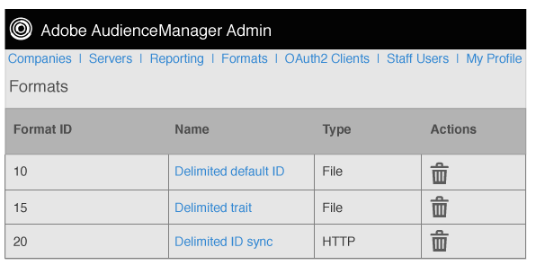

# Översikt över format {#formats-overview}

Ett format är en sparad mall (eller fil) som använder makron för att ordna innehållet i data som skickas till ett mål. Formattyperna inkluderar [!DNL HTTP]-format och filformat. [!DNL HTTP] -format skickar data i ett  [!DNL JSON] objekt med en  [!DNL POST] eller  [!DNL GET] metod. Filformat skickar data i en fil med [!DNL FTP]. Med de makron som används för varje format kan du ange filnamn, definiera filhuvuden och ordna innehållet i en datafil. I Admin [!DNL UI] kan du skapa, spara och återanvända format när du konfigurerar mål för kunder.

